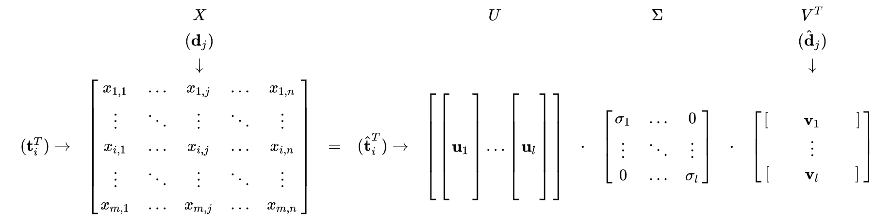

# Latent Semantic Analysis

潜在语义分析，使用 term-document 矩阵来描述 term 在 document 中的出现情况。矩阵中的元素可以是原始频次，也可以加个权重，比如 tf-idf。

## Rank Lowing

构建完成 term-document 矩阵，LSA 需要寻找一个低秩近似的矩阵。原因：

- 原始矩阵过大，计算资源消耗较多。
- 原始矩阵包含噪音，近似矩阵可以看作是一个“去燥”的矩阵。
- 原始矩阵相对于“真正的” term-document 矩阵过于稀疏。原始矩阵只有文档中包含的单词，却并不包含这些单词的同义词。近似矩阵可以解决一义多词的问题。

## Derivation

$$
X = 
\begin{bmatrix}
   x_{1,1} & \dotsm & x_{1,j} & \dotsm & x_{1,n} \\
   \vdots & \ddots & \vdots & \ddots & \vdots \\
   x_{i,1} & \dotsm & x_{i,j} & \dotsm & x_{i,n} \\
   \vdots & \ddots & \vdots & \ddots & \vdots \\
   x_{m,1} & \dotsm & x_{m,j} & \dotsm & x_{m,n}
\end{bmatrix}
$$

存在正交矩阵 $U$ 和 $V$ ，以及对角矩阵 $\Sigma$，能够分解 $X$，即奇异值分解：

$$
X = U \Sigma V^T
$$

$\sigma_1,\dotso,\sigma_l$ 为奇异值，$u_1,\dotso,u_l$ 和 $v_1,\dotso,v_l$ 分别是左奇异向量和右奇异向量。此时，选择 $k$ 个最大的奇异值，以及其在 $U$ 和 $V$ 中对应的奇异向量，就得到了 $X$ 的秩为 $k$ 的近似矩阵，这时的误差最小 (Frobenius norm) 。

$$
X_k = U_k \Sigma_k V_k^T
$$

$\hat{t}_i^T$  是 term 向量，对应 $U_k$ 中的一行；$\hat{d}_j$ 是 document 向量，对应 $V_k^T$ 中的一列。

至此，我们可以利用上式做一些事：

- 文档 $j$ 和 $q$ 的相关度，比较 $\sum_k \cdotp \hat{d}_j$ 和 $\sum_k \cdotp \hat{d}_q$。
- item $i$ 和 $p$ 的相关度，比较 $\sum_k \cdotp \hat{t}_i$ 和 $\sum_k \cdotp \hat{t}_p$。
- 聚类。
- 给定查询语句，检索相关文档，此时需要将输入向量 $d_j$ 转换成潜在语义空间中的向量：$\hat{d}_j = \sum_k^{-1} U_k^T d_j$。同理，对于 item 向量有：$\hat{t}_i = \sum_k^{-1} V_k^T t_i$。

## Limitations