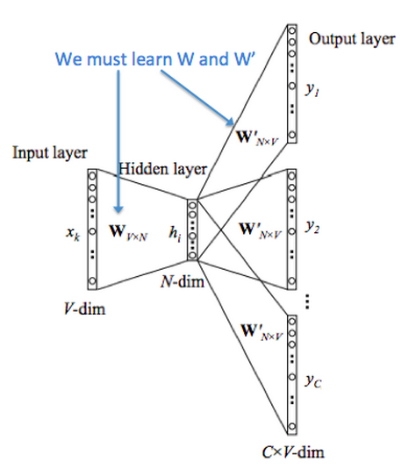

# Word2Vec

Word2vec 包括两个模型：CBOW 和 Skip-Gram 以及两个优化算法：Hierarchical Softmax 和 Negative Sampling。

## CBOW

上下文预测中间词。

### Notations

- $w_i$: 词表 $V$ 中第 $i$ 个单词。
- $\mathcal{V}\in R^{n\times|V|}$: 输入单词矩阵。
- $\mathcal{v_i}$: $\mathcal{V}$ 的第 $i$ 列，$w_i$ 的输入向量表示。
- $\mathcal{U}\in R^{|V|\times n}$: 输出单词矩阵。
- $\mathcal{u_i}$: $\mathcal{U}$ 的第 $i$ 行，$w_i$ 的输出向量表示。

### Steps

1. 上下文用独热编码表示，窗口大小为 $m$: $(x^{(c-m)},...,x^{(c-1)},x^{(c+1)},...,x^{(c+m)} \in R^{|V|})$
2. 输入向量转换: ($\mathcal{v_{c-m}}=\mathcal{V}x^{(c-m)},...,\mathcal{v_{c-1}}=\mathcal{V}x^{(c-1)},\mathcal{v_{c+1}}=\mathcal{V}x^{(c+1)},...,\mathcal{v_{c+m}}=\mathcal{V}x^{(c+m)}$)
3. 平均: $\hat{v}=\frac{v_{c-m}+...+v_{c-1}+v_{c+1}+...+v_{c+m}}{2m}\in{R^n}$
4. 得分: $z=\mathcal{U}\hat{v}\in{R^{|V|}}$
5. 概率: $\hat{y}=softmax(z)\in{R^{|V|}}$

## Skip-Gram 

中间词预测上下文中的词。

